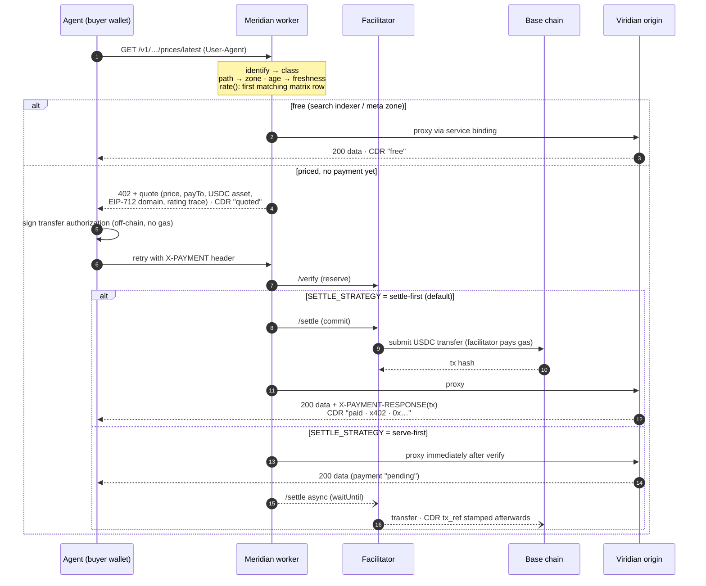

# Meridian — architecture & flow reference

*Updated 2026-08-26, the day of the first real settlement
(tx `0x01a79e16…ba12`, Base Sepolia). Everything below is deployed reality,
not design intent.*

## System map

```
                                  ┌──────────────────────── CLOUDFLARE ───────────────────────┐
  agent / crawler                 │                                                            │
  (buyer wallet) ──── request ──► │  MERIDIAN WORKER  ── service binding ──►  VIRIDIAN WORKER  │
        │                         │  the meter/OCS                            the origin API   │
        │ signs x402              │  · console UI at /                        · /v1 data       │
        │ authorization           │  · rate matrix (KV plan)                  · dashboard at /  │
        ▼                         │  · CDRs + plans (D1)                          │            │
  FACILITATOR (Coinbase/x402.org) │  · /meridian/* API                            ▼            │
  verify + settle                 └───────────────────────────────────────── SUPABASE Postgres │
        │                                                                    (price data)      │
        ▼                                                                        ▲             │
  BASE blockchain (USDC moves buyer → seller wallet 0x7f13…4436)                 │             │
                                                              VPS harvester (systemd, weekly) ─┘
                                                              EC portal + SI TIS XLSX sources
```

- **Viridian** knows nothing about money. **Meridian** knows nothing about farm
  prices. The pair is the product template: any origin behind the same meter.
- Meridian public URL: `https://meridian-rating-worker.dejan-ilesic.workers.dev`
  (console at `/`, agents hit `/v1/*`).
- Viridian public URL: `https://viridian.dejan-ilesic.workers.dev` (status
  dashboard at `/`, same API unmetered — origin is deliberately reachable
  for now; hide it later via access rules if desired).

## Request flow (per request through the meter)



Telco mapping: identify=AAA · rate()=charge selector/impact category ·
verify=reserve · settle=commit · CDR=EDR with settlement reference ·
tiers=FUP · caps=credit limit.

## Payment configuration (wrangler.toml [vars] + secrets)

| var | values | meaning |
|---|---|---|
| `SETTLE_MODE` | `simulated` \| `x402` | pretend header vs real facilitator |
| `SETTLE_STRATEGY` | `settle-first` (default) \| `serve-first` | hash-before-data (safety, +1–2s) vs respond-after-verify (latency; CDR briefly `pending:…`, then stamped; failures visible as `failed:…`) |
| `NETWORK` | `base-sepolia` \| `base` | testnet (free x402.org facilitator, no keys) vs mainnet (CDP facilitator, CDP keys, real USDC) |
| `PAY_TO` | 0x… | seller wallet (key in rating-engine/.env — self-custody) |
| `FACILITATOR_URL` | optional | override the by-network default |
| `ORIGIN` + service binding | URL + `viridian` | the metered origin (workers.dev→workers.dev fetch is blocked → binding required) |
| `ADMIN_TOKEN` (secret) | — | guards POST /meridian/plan (console prompts once) |

## Protocol gotchas (paid for in debugging hours)

1. Client SDKs (x402-fetch) schema-validate the 402: `resource` must be a
   **full URL**, `mimeType` is **required**.
2. The facilitator needs the asset's **EIP-712 domain** in
   `accepts[].extra` — Sepolia USDC `{name:"USDC",version:"2"}`, mainnet
   `{name:"USD Coin",version:"2"}` — else `invalid_exact_evm_missing_eip712_domain`.
3. The facilitator reads `x402Version` from **inside paymentPayload**.
4. x402.org facilitator is V2-first (CAIP-2 networks) but still routes V1;
   V2 header-format upgrade is roadmap, not blocker.
5. The buyer needs **no ETH** — signatures are off-chain, facilitator pays gas.
6. Edge deploys propagate ~30 s; don't debug a 402 four seconds after deploy.
7. Facilitator `/supported` also lists an **`upto` scheme** — spend-cap
   authorization drawn down per request = the prepaid-balance primitive for
   future subscription/bundle offers.

## Runbook

```bash
# meter: deploy after changes (packages/worker)
cd packages/worker && CLOUDFLARE_API_TOKEN=… npx wrangler deploy

# console UI: rebuild then deploy the worker (assets ship with it)
cd packages/ui && npm run build && cd ../worker && npx wrangler deploy

# publish a plan from YAML (or use the console + admin token)
npx tsx -e "…parse tariffs/viridian.yaml…" | curl -X POST …/meridian/plan \
  -H "Authorization: Bearer $MERIDIAN_ADMIN_TOKEN" -d @-

# demo buyer (rating-engine root; .env has BUYER_PRIVATE_KEY)
npx tsx demo/buy.ts                                    # butter /latest
npx tsx demo/buy.ts /v1/products/tolminski-sir/prices/latest

# watch the meter live
npx wrangler tail        # x402 failures logged as "x402 verify/settle failed: …"
```

Wallets (keys in `rating-engine/.env`, gitignored): seller `0x7f13…4436`,
demo buyer `0x32AA…59DD` (fund: faucet.circle.com → Base Sepolia).
Mainnet flip: `NETWORK=base` + CDP API keys + back up the seller key first.

## Layer map (BRM vocabulary) — where this is going

| BRM concept | Meridian today | roadmap |
|---|---|---|
| PDC / charge selector | rate matrix + models (done) | sentence view, OpenAPI zone import |
| Online charging (OCS) | 402/verify/settle pipeline (done, real) | V2 headers, `upto` prepaid scheme |
| EDR/CDR + RA | CDRs w/ tx hash; Coverage view (done) | payer wallet into CDR; delta report |
| Billing care | — | Customers view: CDRs grouped by buyer, itemized statement |
| Product catalog / offers | single published plan | offers compile onto the matrix: subscriptions = entitlement + $0-to-FUP rows; bundles = zone entitlements; prepaid = `upto` |
